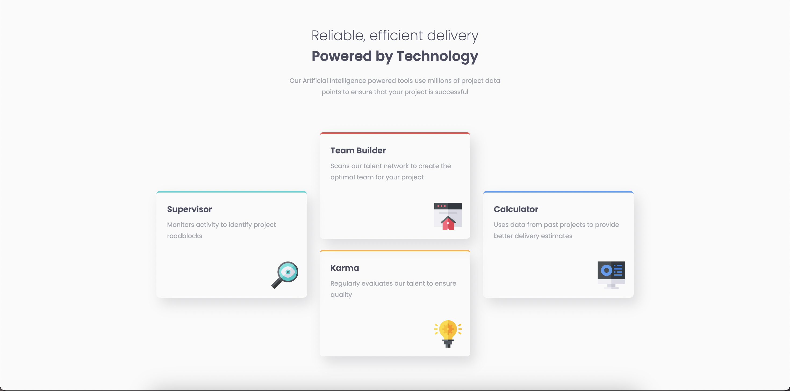
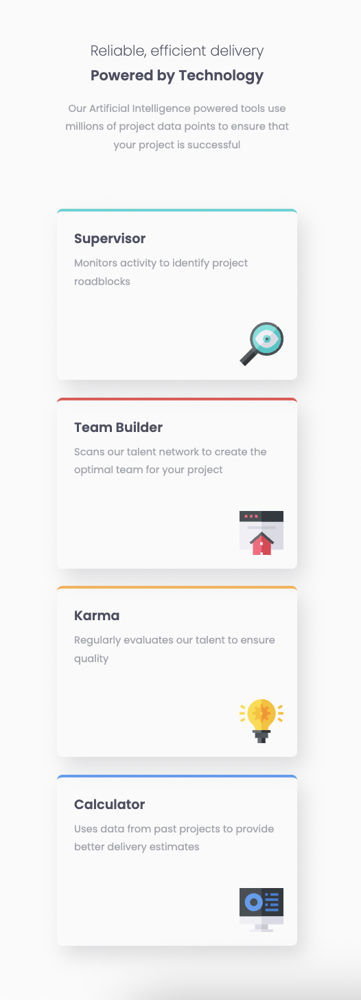

# Frontend Mentor - Four card feature section solution

This is a solution to the [Four card feature section challenge on Frontend Mentor](https://www.frontendmentor.io/challenges/four-card-feature-section-weK1eFYK). Frontend Mentor challenges help you improve your coding skills by building realistic projects. 

## Table of contents

- [Overview](#overview)
  - [The challenge](#the-challenge)
  - [Screenshot](#screenshot)
  - [Links](#links)
- [My process](#my-process)
  - [Built with](#built-with)
  - [What I learned](#what-i-learned)
  - [Continued development](#continued-development)
  - [Useful resources](#useful-resources)
- [Author](#author)

## Overview

### The challenge

Users should be able to:

- View the optimal layout for the site depending on their device's screen size

### Screenshots

#### Desktop



#### Mobile



### Links

- Solution URL: [Github](hhttps://github.com/lindajensen/four-card-feature-section-master.git)
- Live Site URL: [Netlify](https://ruby-four-card-feature-section-master.netlify.app/)

## My process

### Built with

- Semantic HTML5 markup
- CSS custom properties
- Flexbox
- Mobile-first workflow

### What I learned

I learned a lot about Flexbox, more specifically about the CSS Property -- align-self -- which I had not used before.  

```css
    .inner-container {
        display: flex;
        flex-direction: row;
        column-gap: 30px;
        margin: 0 auto;
    }

    .box.cyan {
        align-self: center;
    }

    .box.blue {
        align-self: center;
    }
```

### Continued development

I need to keep practicing a mobile-first workflow and also keep using Flexbox. I need to learn more about CSS Grid as well. I also need lo learn more about the CSS Property -- position -- because I definitely do not know enough about that. 

### Useful resources

- [CSS Tricks - A Complete Guide to Flexbox](https://css-tricks.com/snippets/css/a-guide-to-flexbox/) - This helped me with Flexbox and the align-self property.

## Author

- Github - [Linda Jensen](https://github.com/lindajensen)
- Frontend Mentor - [@lindajensen](https://www.frontendmentor.io/profile/lindajensen)
- LinkedIn - [Linda Jensen](www.linkedin.com/in/linda-jensen-swe)


